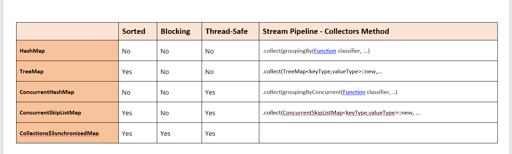

# threads

# Threads

## Tworzenie threadów

✅ 1. Dziedziczenie po klasie Thread

```java
class MyThread extends Thread {
public void run() {
System.out.println("Wątek działa!");
}

    public static void main(String[] args) {
        MyThread t = new MyThread();
        t.start(); // Uruchamiamy wątek
    }
}
```

✅ 2. Implementacja interfejsu Runnable

```java
class MyRunnable implements Runnable {
public void run() {
System.out.println("Wątek działa!");
}

    public static void main(String[] args) {
        Thread t = new Thread(new MyRunnable());
        t.start();
    }
}
```

✅ 3. Z użyciem wyrażeń lambda (od Javy 8)

```java
public class Main {
    public static void main(String[] args) {
        Thread t = new Thread(() -> {
            System.out.println("Wątek działa!");
        });
        t.start();
    }
}
```

### Start i run

start() – tworzy nowy wątek i uruchamia metodę run().
run() – uruchamia metodę w tym samym wątku, bez tworzenia nowego.

## Synchronized

## volatile

## Intrinsic lock

## Deadlock

## Lock

java.util.concurrent

tryLock();

## Thread Pool Executor

ThreadPoolExecutor to zaawansowany mechanizm w Javie do zarządzania pulą wątków. Zamiast tworzyć nowy wątek dla każdego zadania (co jest kosztowne), utrzymuje on pulę wątków, które mogą być ponownie używane do wykonywania wielu zadań.
Zazwyczaj korzysta się z gotowych metod fabrycznych w Executors, np.:

```java
ExecutorService executor = Executors.newFixedThreadPool(4); // 4 wątki w puli
```

Albo ręcznie:

```java
ThreadPoolExecutor executor = new ThreadPoolExecutor(
    2,              // corePoolSize
    4,              // maximumPoolSize
    60,             // keepAliveTime
    TimeUnit.SECONDS,
    new LinkedBlockingQueue<Runnable>() // kolejka zadań
);
```

## Executor

## Executors

## ThreadFactory

## Thread Pool Varations

## Runnable i Callable

Callable zwraca wartość w klasie Future
Execute nie zwraca jej

### Future

Future interface reprezentuje rezult wykonanej asynchronicznej komputacji.

# Thread Stealing Pool

# Hash Map



# Atomic

# WatchService