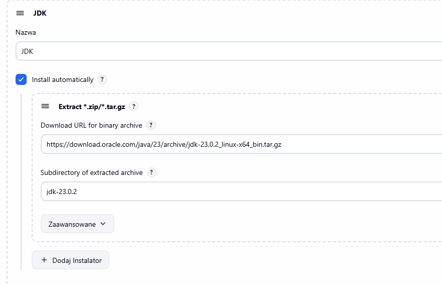

# Jenkins

Komendy

| `docker exec -it jenkins bash` | ✅ **Uruchom interaktywną sesję powłoki (`bash`) wewnątrz działającego kontenera Dockera o nazwie `jenkins`. Tj, wchodzimy do kontenera i możemy uruchamiać w nim komendy.**  |
| --- | --- |
|  |  |
|  |  |

[https://github.com/jenkinsci/pipeline-examples/tree/master/jenkinsfile-examples](https://github.com/jenkinsci/pipeline-examples/tree/master/jenkinsfile-examples)

[https://www.jenkins.io/doc/pipeline/steps/](https://www.jenkins.io/doc/pipeline/steps/)

# Budowa obrazu Jenkinsa

```bash
// Pobieramy obraz
docker pull jenkins/jenkins:latest
```

```bash
// Uruchamiamy Jenkinsa ( w tym przypadku dodajemy też kod pozwalający na 
łączenie się go z Dockerem) Poprzez host TCP

docker run -d --name jenkins ` // Nazwa kontenera
  -p 8080:8080 -p 50000:50000 ` //Porty
  -v D:\Jenkins\jenkins_home:/var/jenkins_home ` // Mapujemy dysk
  -v /var/run/docker.sock:/var/run/docker.sock ` // Mapujemy socket
  -e DOCKER_HOST=tcp://host.docker.internal:2375 `
  --group-add 102 ` //dodanie do grupy network
  jenkins/jenkins // wskazujemy obraz
  
  // Bez hosta, z socketem i dodaniem do grupy
  docker run -d --name jenkins `
  -p 8080:8080 -p 50000:50000 `
  -v D:\Jenkins\jenkins_home:/var/jenkins_home `
  -v /var/run/docker.sock:/var/run/docker.sock `
  --group-add 102 `
  jenkins-docker
  
// Bez hosta, z socketem 
docker run -d  --name jenkins `
  -p 8080:8080  -p 50000:50000 `
  -v D:\Jenkins\jenkins_home:/var/jenkins_home `
  -v /var/run/docker.sock:/var/run/docker.sock `
  jenkins-docker
```

Po zainstalowaniu nowego środowiska trzeba dostać się do pliku z sekretnym hasłem niezbędnym do pierwszego uruchomienia. Znajduje się ono w kontenerze/w folderze Jenkinsa. 

```bash
//Odpalamy Jenkinsa i wchodzimy w konsolę
docker exec -it jenkins bash
// Pobieramy hasło
cat /var/jenkins_home/secrets/initialAdminPassword | Set-Clipboard // Pobranie do schowka

//lub naraz:
docker exec -it jenkins cat /var/jenkins_home/secrets/initialAdminPassword

```

Po odpaleniu Jenkinsa trzeba też skonfigurować zmienne środowiskowe, jak Maven i JDK. Robimy to poprzez `Manage → Tools → JDK + Maven`



## Dodanie poświadczeń Jenkins/GitHub

Tworząc pipeline i łacząc go (np. z GitHubem) potrzebne są uprawnienia. W przypadku GitHuba generujemy token: 

1. W GithubTokens generujemy token API i dodajemy uprawnienia do **Contents.**
2. Połączenie Jenkinsa z Githubem. Dodajemy poświadczenia w Jenkinsie ****Dashboard → Manage Jenkins → Credentials → System → Global credentials (unrestricted). Klikamy **Add Credentials.** Następnie: Wybierz typ: `Username with password` i Wypełnij pola:
    - **Username:** Twój login GitHubowy (np. `kamil-szymanski`)
    - **Password:** Wklej token (PAT)
    - **ID:** (opcjonalne, np. `github-token`).
3. Otwórz swój projekt w Jenkinsie. W sekcji Source Code Management → Git: Repository URL: podajemy adres do repozytorium zakończony **.git:** `https://github.com/xxxxx/SeleniumTestAutomation.git`
- W polu **Credentials** wybieramy te, które dodaliśmy przed chwilą (krok `github-token`).
- Kliknij **Save**, potem **Build Now**.
- Podajemy też scriptPath np. `src/test/java/Selenium/BoniGarcia/boniGarciaPipeline.jenkinsfile`
    
    Ważne, żeby Jenkins i Selenium były w jednej sieci. Konfigurujemy to w dockerze. 
    

## Jenkinsfile

Przykład:

```bash
pipeline {
    agent any // uruchamia pipeline na dowolnym dostępnym agencie (maszynie buildowej)

    environment {
        // zmienne środowiskowe dostępne w całym pipeline
        MAVEN_HOME = '/usr/share/maven'
        PATH = "${MAVEN_HOME}/bin:${env.PATH}"
    }

    stages {
        stage('Checkout') {
            steps {
                echo 'Pobieranie kodu z repozytorium...'
                git branch: 'main', url: 'https://github.com/uzytkownik/projekt.git'
                credentialsId: 'credentialsABC'
            }
        }

        stage('Build') {
            steps {
                echo 'Budowanie projektu...'
                sh 'mvn clean package -DskipTests' // sh - shell linuxa
            }
        }

        stage('Unit Tests') {
            steps {
                echo 'Uruchamianie testów jednostkowych...'
                sh 'mvn test'
            }
            post {
                always {
                    junit '**/target/surefire-reports/*.xml' // raport z testów
                }
            }
        }

        stage('Static Code Analysis') {
            steps {
                echo 'Analiza jakości kodu...'
                sh 'mvn sonar:sonar -Dsonar.projectKey=mojProjekt'
            }
        }

        stage('Integration Tests') {
            steps {
                echo 'Testy integracyjne...'
                sh 'mvn verify -Pintegration-tests'
            }
        }

        stage('Deploy to Test Environment') {
            steps {
                echo 'Wdrażanie na środowisko testowe...'
                sh './deploy/test-deploy.sh'
            }
        }

        stage('Deploy to Production') {
            when {
                branch 'main' // tylko gdy pipeline działa na branchu main
            }
            steps {
                input message: 'Czy na pewno wdrożyć na produkcję?', ok: 'Tak, wdrażaj'
                echo 'Wdrażanie na produkcję...'
                sh './deploy/prod-deploy.sh'
            }
        }
    }

    post {
        always {
            echo 'Zakończono pipeline — sprzątanie środowiska.'
        }
        success {
            echo 'Pipeline zakończony sukcesem 🎉'
        }
        failure {
            echo 'Błąd pipeline — wysyłanie maila.'
            mail to: 'devteam@firma.pl',
                 subject: 'Błąd w Jenkins Pipeline',
                 body: 'Pipeline zakończył się niepowodzeniem.'
        }
    }
}

```

Możemy włączyć formatowanie plików Jenkins w  Intelij. Robimy to w Setting - File type - do Groovy dodajemy *.jenkinsfile.

---

Możemy parametryzować w testng.xml adres do kontegera z gridem

```bash
  <parameter name="url" value="http://<nazwa_kontenera>:4444/wd/hub"/> <!-- Adres Hub w Dockerze -->

```

💡 W przypadku włączonego BiDi w Selenium, jako adres podajemy nazwę kontenera. 

W przypadku BiDi (Bidirectional Protocol) w Selenium, możemy używać nazwy kontenera jako adresu z kilku powodów:

**Docker DNS i networking**
Docker automatycznie tworzy wewnętrzną sieć DNS dla kontenerów. Gdy kontenery działają w tej samej sieci Docker, mogą się ze sobą komunikować używając nazw kontenerów zamiast adresów IP. Docker DNS rozwiązuje nazwę kontenera na jego wewnętrzny adres IP.

```xml
Zmienna przekazywana z jenkinsa
<!DOCTYPE suite SYSTEM "http://testng.org/testng-1.0.dtd">
<suite name="MyTestSuite">
    <parameter name="myParam" value="${MY_PARAM}" />
    <test name="MyTest">
        <classes>
            <class name="com.example.MyTestClass" />
        </classes>
    </test>
</suite>
```

W Jenkinsie, w sekcji budowania (np. "Execute shell" lub w Pipeline), uruchamiamy Maven z przekazaniem parametru:
`mvn test -DMY_PARAM=$MY_PARAM`

Gdy uruchamiamy testy lokalnie (np. mvn test), zmienna MY_PARAM nie będzie zdefiniowana, więc TestNG użyje wartości domyślnej z testng.xml lub pozostawi parametr pusty. Możemy też w kodzie testowym sprawdzić, czy parametr jest pusty:

```groovy
pipeline {
    agent any
    parameters {
        string(name: 'MY_PARAM', defaultValue: '', description: 'Parameter for TestNG')
    }
    stages {
        stage('Test') {
            steps {
                sh 'mvn test -DMY_PARAM=$MY_PARAM'
            }
        }
    }
}
```

### Powiązanie Jenkinsa z daemonem Dockera

Ręczne połączenie Jenkinsa z Dockerem:

```powershell
docker exec -u root jenkins-docker chmod 666 /var/run/docker.sock
```

```powershell
docker run --rm -v /var/run/docker.sock:/var/run/docker.sock alpine ls -ln /var/run/docker.sock

#To jest mount bind:
#Pierwsza ścieżka: /var/run/docker.sock — plik socket Dockera na hoście.
#Druga ścieżka: /var/run/docker.sock — gdzie kontener zobaczy ten plik.
#Efekt: kontener może komunikować się z Dockerem hosta tak, jakby był lokalnym klientem.
```

Napraw uprawnienia w działającym kontenerze (Bez restartu)

Jeśli nie chcesz kasować kontenera, możesz wejść do niego jako root i zmienić uprawnienia pliku socketu, tak aby każdy (w tym użytkownik `jenkins`) mógł z niego korzystać.

1. Otwórz terminal na Windowsie (PowerShell/CMD).
2. Wykonaj polecenie (jako root wewnątrz kontenera):Bash
    
    `docker exec -u 0 -it <ID_TWOJEGO_KONTENERA_JENKINS> chmod 666 /var/run/docker.sock`
    
    *(Zastąp `<ID_TWOJEGO_KONTENERA_JENKINS>` nazwą lub ID kontenera).*
    

To nada uprawnienia "read/write" dla wszystkich użytkowników do gniazda Dockera.
*Uwaga: Po restarcie kontenera Jenkinsa uprawnienia mogą (ale nie muszą) wrócić do domyślnych, zależnie od tego, jak Docker Desktop zarządza montowaniem.*

## **Metoda 1: Docker Socket Binding (Zalecana lokalnie)**

Jest to najprostsza i standardowa metoda dla środowisk developerskich (np. Docker Desktop na Windows/Mac, lokalny Linux). Polega na "pożyczeniu" gniazda Dockera z hosta do kontenera Jenkinsa.

**Zalety:** Prosta konfiguracja, działa od razu.

**Wady:** Kontener Jenkinsa ma pełną kontrolę nad Dockerem hosta (w produkcji wymaga ostrożności).

**Krok 1: Przygotowanie Dockerfile**

Musimy stworzyć własny obraz Jenkinsa, który zawiera klienta Dockera i odpowiednie uprawnienia.

**`Dockerfile`:**

```docker

FROM jenkins/jenkins:lts
# Używamy wersji lts (Long Term Support) - stabilniejsza niż latest

USER root

# 1. Instalacja klienta Dockera wewnątrz kontenera Jenkinsa
# Pozwala to na używanie komendy 'docker' w pipeline'ach.
RUN apt-get update && \
    apt-get install -y docker.io && \
    rm -rf /var/lib/apt/lists/*

# 2. Dodanie użytkownika jenkins do grupy 'docker'
# To KLUCZOWE, aby Jenkins mógł komunikować się z Dockerem hosta poprzez /var/run/docker.sock.
# 'groupadd -f docker' tworzy grupę, jeśli nie istnieje.
RUN groupadd -for -g 999 docker && \
    usermod -aG docker jenkins

# Powrót do bezpiecznego użytkownika
USER jenkins

```

**Krok 2: Budowanie obrazu**

Będąc w folderze z powyższym plikiem Dockerfile:

```powershell
docker build -t jenkins-docker-group -f jenkins-group.Dockerfile .
```

**Krok 3: Uruchomienie kontenera**

To najważniejszy moment. Musimy przekazać gniazdo (**`/var/run/docker.sock`**) z hosta do kontenera. Możemy zrobić to ręcznie jak poniżej, lub przez Docker compose.

```
docker run -d --name jenkins-docker -p 8080:8080 -p 50000:50000 `
  -v D:\Jenkins\jenkins_home:/var/jenkins_home `
  -v /var/run/docker.sock:/var/run/docker.sock `
  jenkins-docker-group bash -c "chmod 666 /var/run/docker.sock && /usr/bin/tini -- /usr/local/bin/jenkins.sh"
  
  
 docker run -d `
  --name jenkins-docker `
  -p 8080:8080 `
  -p 50000:50000 `
  -v D:\Jenkins\jenkins_home:/var/jenkins_home `
  -v /var/run/docker.sock:/var/run/docker.sock `
  jenkins-docker-group

```

*Uwaga: W Docker Desktop na Windows ścieżka **`/var/run/docker.sock`** działa poprawnie (jest mapowana wewnętrznie).*

**Weryfikacja**

```
docker exec -it jenkins-docker 
docker ps
# Powinno zwrócić listę kontenerów działających na HOŚCIE.
```

---

**Metoda 2: Połączenie przez TCP bez TLS (Niezalecane!)**

Metoda polega na wystawieniu daemona Dockera na porcie sieciowym (zazwyczaj 2375) bez szyfrowania.

**Status: NIEBEZPIECZNE. Używać tylko do testów w całkowicie izolowanej sieci. Wystawia Dockera na ataki.**

**Wymagania wstępne (Host)**

Należy skonfigurować daemona Dockera na hoście, aby nasłuchiwał na TCP. W Docker Desktop na Windows często wymaga to zaznaczenia opcji *"Expose daemon on tcp://localhost:2375 without TLS"*.

**Krok 1: Dockerfile**

Wystarczy sam klient dockera, grupa nie jest konieczna (bo nie używamy socketa), ale dobra praktyka nakazuje ją mieć.

```
FROM jenkins/jenkins:lts
USER root
RUN apt-get update && apt-get install -y docker.io && rm -rf /var/lib/apt/lists/*
USER jenkins

```

**Krok 2: Uruchomienie kontenera**

Nie montujemy **`docker.sock`**. Zamiast tego wskazujemy Jenkinsowi, gdzie jest Docker przez sieć, używając zmiennej **`DOCKER_HOST`**.

```
docker run -d `
  --name jenkins-tcp `
  -p 8080:8080 `
  -p 50000:50000 `
  -e DOCKER_HOST=tcp://host.docker.internal:2375 ` # <--- KLUCZOWA LINIA
  jenkins/jenkins:lts

```

*Uwaga: **`host.docker.internal`** to specjalny adres DNS w Docker Desktop, który pozwala kontenerowi odwołać się do hosta (Twojego Windowsa).*

###