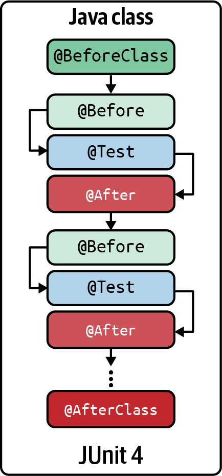

# JUnit4

JUnit to framework testów jednostkowych dla języka Java stworzony przez Ericha Gammę i Kenta Becka w 1999 roku. Jest uważany za de facto standardowy framework do tworzenia testów w Javie. W JUnit test jest metodą w klasie Java używaną do testowania. Począwszy od JUnit 4, adnotacje Java są elementami składowymi do tworzenia testów JUnit. Podstawową adnotacją JUnit 4 jest @Test, ponieważ pozwala ona zidentyfikować metodę (metody), które zawierają logikę testową (tj. kod używany do wykonywania i weryfikacji fragmentu oprogramowania). Ponadto istnieją inne adnotacje służące do identyfikacji metod używanych do konfiguracji (tj. tego, co dzieje się przed testami) i usuwania (tj. tego, co dzieje się po testach).

