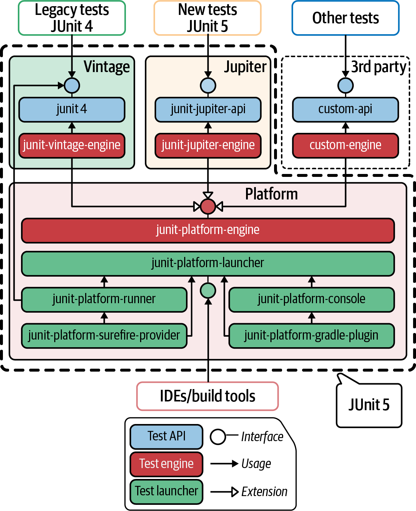

# JUnit5

[Dokumentacja JUnit5](https://junit.org/junit5/docs/current/user-guide/) 

Ze względu na kilka ograniczeń JUnit 4 (takich jak monolityczna architektura lub niemożliwe do skompilowania runnery JUnit), zespół JUnit wydał nową główną wersję (tj. JUnit 5) w 2017 roku. JUnit został całkowicie przeprojektowany w wersji 5, zgodnie z modułową architekturą składającą się z trzech komponentów (patrz rysunek 2-4). Pierwszym komponentem jest Platforma JUnit, będąca fundamentem całego frameworka. Cel platformy JUnit jest dwojaki: - Umożliwia wykrywanie i wykonywanie (sekwencyjne lub równoległe) testów w JVM za pośrednictwem interfejsu API uruchamiania testów. Ten interfejs API jest zwykle używany przez klientów programistycznych, takich jak narzędzia do kompilacji i IDE. - Definiuje API silnika testowego do uruchamiania testów na platformie JUnit. Ten interfejs API jest zwykle używany przez frameworki, które zapewniają modele programowania do testowania.

Dzięki API silnika testowego, frameworki testowe innych firm mogą wykonywać testy na platformie JUnit. Niektóre przykłady istniejących frameworków testowych, które zaimplementowały silniki testowe dla JUnit 5 to TestNG, Cucumber lub Spock. Ponadto JUnit 5 zapewnia dwie gotowe implementacje interfejsu API silnika testowego. Silniki te są pozostałymi komponentami architektury JUnit 5, a mianowicie:
Vintage - Test engine, który zapewnia wsteczną kompatybilność ze starszymi testami JUnit (tj. wersjami 3 i 4). 

Silnik testowy Jupiter, który zapewnia nowy model programowania i rozszerzeń. Jupiter jest istotnym komponentem JUnit 5, ponieważ zapewnia zupełnie nowy interfejs API do tworzenia testów przy użyciu solidnego modelu programowania. Niektóre z funkcji tego modelu programowania to parametryzowane testy, równoległe wykonywanie, tagowanie i filtrowanie, uporządkowane testy, powtarzane i zagnieżdżone testy oraz bogate możliwości wyłączania (ignorowania) testów. Podobnie jak JUnit 4, Jupiter również używa adnotacji Java do deklarowania przypadków testowych. Na przykład adnotacja identyfikująca metody z logiką testowania to również @Test. Nazwy pozostałych adnotacji dla podstawowego cyklu życia testu są nieco inne w Jupiterze: @BeforeAll, @BeforeEach, @AfterEach i @AfterAll. Każda z tych adnotacji jest zgodna z przepływem pracy JUnit 4.

JUnit 5 z Selenium-Jupiter. Model rozszerzeń w Jupiter umożliwia dodawanie własnych funkcji do domyślnego modelu programistycznego. W tym celu Jupiter udostępnia API, które programiści mogą rozszerzać (korzystając z tzw. punktów rozszerzeń – extension points), aby zapewnić własną funkcjonalność. Kategorie tych punktów rozszerzeń to:

- **Wywołania cyklu życia testu**
    
    Pozwalają na dodanie własnej logiki w różnych momentach cyklu życia testu.
    
- **Rozwiązywanie parametrów**
    
    Umożliwiają implementację wstrzykiwania zależności (czyli wstrzykiwanie parametrów do metod testowych lub konstruktorów).
    
- **Szablony testów**
    
    Pozwalają powtarzać testy na podstawie określonego kontekstu.
    
- **Warunkowe wykonywanie testów**
    
    Umożliwiają włączanie lub wyłączanie testów w zależności od niestandardowych warunków.
    
- **Obsługa wyjątków**
    
    Pozwalają zarządzać wyjątkami Javy podczas testu i jego cyklu życia.
    
- **Instancja testowa**
    
    Służą do tworzenia i przetwarzania instancji klasy testowej.
    
- **Przechwytywanie wywołań**
    
    Umożliwiają przechwytywanie wywołań kodu testowego (i decydowanie, czy te wywołania zostaną wykonane).