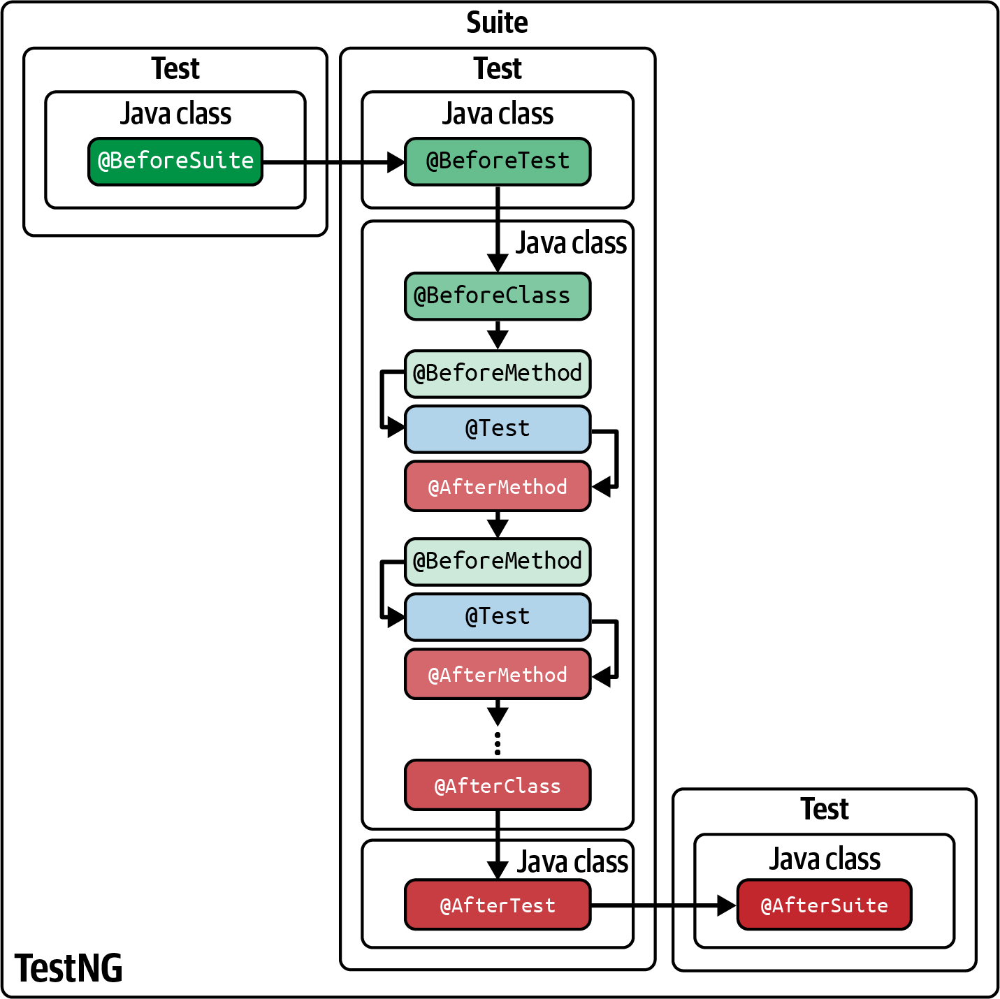

# TestNG

https://testng.org/

## Wprowadzenie: Ewolucja Testowania w Javie i Narodziny TestNG

### Definicja i Geneza TestNG

TestNG, czyli akronim od "Test Next Generation," to framework do testowania w języku Java, który został stworzony przez Cédrica Beusta jako odpowiedź na rosnące zapotrzebowanie na bardziej elastyczne i potężne narzędzie do automatyzacji testów. Framework ten powstał z inspiracji innymi popularnymi rozwiązaniami, takimi jak JUnit i NUnit, ale jego głównym celem było przezwyciężenie ich ograniczeń i dostarczenie funkcjonalności, które wykraczają poza ramy tradycyjnego testowania jednostkowego. W przeciwieństwie do swoich poprzedników, TestNG został zaprojektowany do obsługi szerokiego spektrum kategorii testów — od testów jednostkowych, przez testy funkcjonalne, integracyjne, aż po testy typu end-to-end.

Framework jest oprogramowaniem typu open-source, co sprawia, że jest swobodnie dostępny i może być dostosowywany do specyficznych potrzeb projektów. Ułatwia on systematyczne projektowanie przypadków testowych, umożliwia wykonywanie testów z użyciem wielowątkowości, a także natywnie wspiera parametryzację i testowanie sterowane danymi. Ponadto, TestNG generuje szczegółowe i czytelne raporty w formatach HTML i XML, co ułatwia analizę wyników i udostępnianie ich zespołowi. Wszystkie te cechy pozycjonują TestNG jako kompleksowe narzędzie do zarządzania całym procesem zapewnienia jakości w projekcie.

Niektóre z ważniejsze funkcje oferowane przez TestNG to równoległe wykonywanie testów, priorytetyzacja testów, testowanie oparte na danych przy użyciu niestandardowych adnotacji oraz tworzenie szczegółowych raportów raportów HTML. Podobnie jak JUnit 4 i Jupiter, TestNG również wykorzystuje adnotacje Java do deklarowania testów i ich cyklu życia (tj. testów i ich cyklu życia (tj. tego, co dzieje się przed i po każdym teście).

### Wstępne Porównanie: TestNG vs. JUnit

TestNG i JUnit to dwa najbardziej rozpowszechnione frameworki w ekosystemie Javy. JUnit, będący częścią rodziny xUnit, jest od 1997 roku de facto standardem w testowaniu jednostkowym. Jego popularność wynika z prostoty, łatwości użycia i silnego ukierunkowania na filozofię testowania sterowanego rozwojem oprogramowania (TDD). JUnit doskonale sprawdza się w testowaniu małych, izolowanych fragmentów kodu.

TestNG, powstały w 2004 roku, jest z kolei postrzegany jako jego naturalna ewolucja. Chociaż oba frameworki dzielą wiele podobieństw, w tym wsparcie dla adnotacji i asercji, TestNG wyróżnia się szeregiem zaawansowanych funkcji, które przekraczają możliwości JUnit. Należą do nich między innymi wbudowane wsparcie dla równoległego wykonywania testów, bardziej elastyczna obsługa testów sterowanych danymi za pomocą

`@DataProvider` oraz bardziej zaawansowana hierarchia adnotacji konfiguracyjnych. Te dodatkowe funkcjonalności sprawiają, że TestNG jest szczególnie polecany do dużych, złożonych projektów, gdzie testy wykraczają poza tradycyjne testowanie jednostkowe.

Przejście od JUnit do TestNG stanowi istotną zmianę paradygmatu w procesie zapewniania jakości. Klasyczny JUnit, jako narzędzie do testów jednostkowych, koncentruje się na pojedynczych komponentach i zachęca do izolowania testów. Wraz z dojrzewaniem metodyk zwinnych i wzrostem złożoności systemów, pojawiła się potrzeba zarządzania testami funkcjonalnymi, integracyjnymi i end-to-end w sposób bardziej spójny i wydajny. Właśnie w tym momencie TestNG wyłania się jako rozwiązanie. Jego zdolność do natywnej obsługi równoległości, złożonych zależności i parametryzacji jest odpowiedzią na wyzwania związane z testowaniem na dużą skalę, np. w ramach ciągłej integracji i dostarczania oprogramowania (CI/CD). Zatem, wybór TestNG często oznacza, że projekt wymaga strategicznego podejścia do całego cyklu testowania, wychodzącego poza ramy testów jednostkowych. Z tego powodu TestNG nie jest jedynie ulepszoną wersją JUnit, ale odrębnym podejściem, które przenosi myślenie o testowaniu z poziomu izolowanych komponentów na poziom spójnego, zintegrowanego systemu.

## Podstawowe Elementy Konstrukcyjne TestNG: Adnotacje i Plik `testng.xml`

### System Adnotacji: Kontrolowanie Cyklu Życia Testów

Fundamentem frameworka TestNG jest jego bogaty i precyzyjny system adnotacji. Adnotacje to specjalne znaczniki, poprzedzone symbolem`@`, które dodają metadane do kodu źródłowego, bez zmiany jego logiki, i przekazują frameworkowi instrukcje dotyczące sposobu wykonywania metod. W odróżnieniu od prostszych adnotacji JUnit, TestNG oferuje hierarchiczny zestaw znaczników, co zapewnia granularną kontrolę nad cyklem życia testów.

Hierarchia adnotacji w TestNG, od najszerszego do najwęższego zakresu wykonania, prezentuje się następująco:

- `@BeforeSuite` i `@AfterSuite`: Metody oznaczone tymi adnotacjami są wykonywane tylko raz — przed/po wszystkich testach w całym pakiecie (suite). Są one idealne do globalnej konfiguracji, np. uruchomienia serwera Appium przed wszystkimi testami.
- `@BeforeTest` i `@AfterTest`: Działają na poziomie tagu `<test>` w pliku `testng.xml`, co oznacza, że są wykonywane raz przed/po wszystkich testach w obrębie danego elementu. Przykładem użycia jest inicjalizacja lub zamknięcie przeglądarki.
- `@BeforeClass` i `@AfterClass`: Metody z tymi adnotacjami są wykonywane raz przed/po wszystkich metodach testowych w danej klasie. Są one używane do operacji, które muszą być wykonane jeden raz dla całej klasy, np. inicjalizacji sterownika WebDriver.
- `@BeforeMethod` i `@AfterMethod`: Te adnotacje działają na najbardziej szczegółowym poziomie. Metody, które nimi oznaczono, są wykonywane przed/po **każdą** metodą testową w klasie. Jest to idealne rozwiązanie do powtarzalnych operacji, takich jak logowanie do aplikacji przed każdym testem, co jest częstym wymogiem w testach automatyzacji interfejsu użytkownika.
- `@Test`: Jest to najważniejsza adnotacja, która definiuje daną metodę jako właściwy przypadek testowy. Cała logika testu zawarta jest w metodzie oznaczonej tą adnotacją. Dodatkowo, atrybuty tej adnotacji pozwalają na ustawienie priorytetu (
    
    `priority`), zależności (`dependsOnMethods`) lub włączenie/wyłączenie testu (`enabled`).
    
- `@BeforeGroups` i `@AfterGroups` : Te adnotacje pozwalają uruchamiać kod **przed/po wszystkich testach w danej grupie**. Przydaje się np. gdy chcemy przygotować lub posprzątać środowisko tylko dla określonej grupy testów.

Taka granularność w zarządzaniu cyklem życia testów pozwala na tworzenie złożonych scenariuszy automatyzacji, gdzie precyzyjne ustawienie warunków wstępnych i końcowych jest kluczowe.



### Plik `testng.xml`: Serce Konfiguracji Test Suite

Jedną z kluczowych innowacji TestNG jest wprowadzenie pliku `testng.xml` jako centralnego punktu do konfigurowania i uruchamiania testów. Ten plik konfiguracyjny, w formacie XML, pozwala na zdefiniowanie całego pakietu testów w jednym miejscu, eliminując konieczność hardcodowania konfiguracji w poszczególnych klasach testowych. Plik `testng.xml` oddziela logikę testów od ich sposobu wykonania, co jest fundamentalną zasadą w projektowaniu skalowalnych i utrzymywalnych frameworków automatyzacji.

Struktura pliku `testng.xml` jest hierarchiczna i logiczna :

- `<suite>`: Element najwyższego poziomu, reprezentujący cały pakiet testów, który może zawierać wiele tagów `<test>`.
- `<test>`: Element zawarty w `<suite>`, grupujący testy logicznie. Może zawierać listę klas lub pakietów do przetestowania.
- `<classes>`: Zawiera listę klas, które mają zostać uruchomione w ramach danego testu.
- `<class$>`: Określa pojedynczą klasę testową. Możliwe jest precyzyjne sterowanie wykonaniem metod wewnątrz klasy za pomocą tagu
    
    `<methods>` z tagami `<include>` i `<exclude>`.
    

```java
<?xml version="1.0" encoding="UTF-8"?>
<!DOCTYPE suite SYSTEM "https://testng.org/testng-1.0.dtd">

<!-- 
    Plik testng.xml – pełna konfiguracja do uruchamiania testów z TestNG
    Wspiera: parametryzację, wiele klas, selekcję metod, grupy i uruchamianie równoległe.
-->

<suite name="SuiteE2E" verbose="2" parallel="tests" thread-count="3">

<listeners>
        <listener class-name="listeners.MyTestListener"/>
        <listener class-name="listeners.ReportListener"/>
    </listeners>

    <!-- Parametry globalne dostępne w całej suite -->
    <parameter name="baseUrl" value="https://mojaaplikacja.pl"/>
    <parameter name="env" value="staging"/>

    <!-- === TEST 1: Testy logowania === -->
    <test name="LoginTesty">
        <!-- Parametry tylko dla tego testu -->
        <parameter name="browser" value="chrome"/>

        <classes>
            <class name="tests.LoginTests">
                <!-- Uruchom tylko wybrane metody -->
                <methods>
                    <include name="testLoginValid"/>
                    <include name="testLoginInvalid"/>
                    <exclude name="testForgotPassword"/>
                </methods>
            </class>
        </classes>
    </test>

    <!-- === TEST 2: Testy koszyka === -->
    <test name="CartTesty">
        <parameter name="browser" value="firefox"/>
        <classes>
            <class name="tests.CartTests"/>
        </classes>
    </test>

    <!-- === TEST 3: Uruchamianie według grup === -->
    <test name="TestySmoke">
        <groups>
            <run>
                <include name="smoke"/>
                <exclude name="wip"/>
            </run>
        </groups>
        <classes>
            <class name="tests.ProductTests"/>
            <class name="tests.PaymentTests"/>
        </classes>
    </test>

</suite>

```

Oddzielenie konfiguracji od logiki testów ma głębokie implikacje architektoniczne. Umożliwia ono łatwe dostosowywanie ustawień testów, takich jak kolejność wykonania, parametryzacja czy równoległość, bez wprowadzania zmian w samym kodzie testowym. Na przykład, ten sam zestaw testów może być uruchomiony w różnych przeglądarkach (np. Chrome i Firefox), wystarczy tylko zmienić parametry w pliku XML. Ta separacja odpowiedzialności znacząco ułatwia utrzymanie i skalowanie pakietów testowych, czyniąc je bardziej elastycznymi w dynamicznych środowiskach deweloperskich, co jest kluczowe dla zaawansowanych projektów automatyzacji.

Plik `xml` tworzymy np. w InteliJ w projekcjie ,wybierając jeden z formatów plików. 

<aside>
💡

**Template do TestNG w Intelij:** 

**Otwórz ustawienia szablonów plików**

- `File → Settings (Ctrl+Alt+S)`
- Przejdź do: **Editor → File and Code Templates → Files**
- **Dodaj nowy szablon**
    - Kliknij **`+`** (Add).
    - Nazwij go np. **`TestNG XML`**.
    - W polu **Extension** wpisz: `xml`.
    - W polu **Template text** wklej domyślną zawartość pliku TestNG
- **Zapisz**.
- Teraz, gdy klikniesz **File → New → TestNG XML**, IntelliJ utworzy taki plik od razu w katalogu projektu.
</aside>

**Najczęściej używane znaczniki i atrybuty w `testng.xml`**

| Znacznik / Atrybut | Poziom | Opis | Przykład |
| --- | --- | --- | --- |
| `<suite>` | główny | Najwyższy element, który grupuje wszystkie testy w ramach suity. | `<suite name="MojaSuite" verbose="1">` |
| `name` (w `<suite>`, `<test>`) | atrybut | Nazwa suity lub testu, wyświetlana w raportach. | `name="Login Tests"` |
| `verbose` | atrybut | Poziom szczegółowości logów (0–10, gdzie 0 to minimalne logowanie, 10 to maksymalne). | `verbose="2"` |
| `parallel` | atrybut | Określa tryb równoległego wykonywania: `tests`, `classes`, `methods`, `instances`. | `parallel="methods"` |
| `thread-count` | atrybut | Liczba wątków używanych przy równoległym uruchamianiu testów. | `thread-count="3"` |
| `configfailurepolicy` | atrybut | Decyduje, czy kontynuować testy po niepowodzeniu konfiguracji (`skip` lub `continue`). | `configfailurepolicy="continue"` |
| `preserve-order` | atrybut | Zachowuje kolejność wykonywania testów zgodnie z definicją w pliku XML. | `preserve-order="true"` |
| `<parameter>` | w `<suite>` lub `<test>` | Definiuje parametr przekazywany do testów, używany z adnotacją `@Parameters`. | `<parameter name="browser" value="chrome"/>` |
| `<test>` | podrzędny | Grupuje klasy testowe w ramach jednego zestawu testów. | `<test name="Auth Tests">` |
| `enabled` | atrybut | Włącza (`true`) lub wyłącza (`false`) dany test lub suitę. | `enabled="true"` |
| `<classes>` | w `<test>` | Grupuje klasy testowe, które mają być uruchomione w ramach testu. | `<classes> ... </classes>` |
| `<class>` | w `<classes>` | Określa pojedynczą klasę testową z pełną nazwą pakietową. | `<class name="tests.LoginTests"/>` |
| `<methods>` | w `<class>` | Pozwala określić konkretne metody testowe do włączenia lub wykluczenia. | `<methods> <include name="testValidLogin"/> </methods>` |
| `<include>` | w `<methods>` lub `<groups>` | Włącza konkretną metodę lub grupę do wykonania. | `<include name="testValidLogin"/>` |
| `<exclude>` | w `<methods>` lub `<groups>` | Wyklucza konkretną metodę lub grupę z wykonania. | `<exclude name="testInvalidLogin"/>` |
| `<groups>` | w `<test>` | Definiuje grupy testów do uruchomienia lub wykluczenia. | `<groups> <run> <include name="regression"/> </run> </groups>` |
| `<run>` | w `<groups>` | Określa, które grupy mają być włączone lub wykluczone w teście. | `<run> <include name="smoke"/> <exclude name="broken"/> </run>` |
| `<listeners>` | w `<suite>` lub `<test>` | Definiuje niestandardowe listenery TestNG, np. do raportowania lub modyfikacji zachowania testów. | `<listeners> <listener class-name="utils.CustomListener"/> </listeners>` |
| `<listener>` | w `<listeners>` | Określa klasę listenera z pełną nazwą pakietową. | `<listener class-name="utils.CustomListener"/>` |
| `<packages>` | w `<test>` | Pozwala określić pakiety, z których wszystkie klasy testowe mają być uruchomione. | `<packages> <package name="tests.*"/> </packages>` |
| `<package>` | w `<packages>` | Definiuje pakiet, którego klasy mają być uwzględnione w teście. | `<package name="tests.login.*"/>` |
| `group-by-instances` | atrybut | Grupuje testy według instancji klasy zamiast według klas (używane przy `parallel="instances"`). | `group-by-instances="true"` |
| `time-out` | atrybut | Określa maksymalny czas (w milisekundach) dla wszystkich testów w suicie lub teście. | `time-out="60000"` |
| `<suite-files>` | w `<suite>` | Pozwala na dołączanie innych plików `testng.xml` do suity. | `<suite-files> <suite-file path="testng-module.xml"/> </suite-files>` |
| `<suite-file>` | w `<suite-files>` | Określa ścieżkę do dodatkowego pliku `testng.xml`. | `<suite-file path="testng-module.xml"/>` |
| `<!DOCTYPE suite SYSTEM "...">` | deklaracja | Wymagana deklaracja DTD dla poprawności struktury XML w TestNG. | `<!DOCTYPE suite SYSTEM "<https://testng.org/testng-1.0.dtd>">` |

# Parametryzowanie testów

Adnotacja `@Parameters` pozwala na przekazywanie wartości **zdefiniowanych w pliku `testng.xml`** do testów. **Parametryzacja testów** pozwala na uruchamianie tej samej metody testowej z różnymi danymi, bez potrzeby duplikowania kodu. Dzięki temu testy stają się bardziej elastyczne, czytelne i łatwiejsze w utrzymaniu. 

Dzięki temu możemy np. uruchamiać te same testy na różnych środowiskach (`dev`, `test`, `prod`) albo z różnymi danymi użytkowników.

- Parametry definiuje się w pliku `testng.xml`, a w klasie testowej odbiera za pomocą adnotacji `@Parameters`.
- Każdy parametr w XML ma nazwę (`name`) i wartość (`value`).

**Przykład:**

```xml
<!-- testng.xml -->
<suite name="Suite">
    <test name="LoginTest">
        <parameter name="username" value="admin"/>
        <parameter name="password" value="1234"/>
        <classes>
            <class name="tests.LoginTest"/>
        </classes>
    </test>
</suite>

```

Parametry, w zależności czy wstawimy w `<suite>`, czy w `<test>`, użyte zostaną we wskazanym obszarze testów.  

```java
// LoginTest.java
import org.testng.annotations.Parameters;
import org.testng.annotations.Test;

public class LoginTest {

    @Parameters({"username", "password"})
    @Test
    public void loginTest(String user, String pass) {
        System.out.println("User: " + user + ", Pass: " + pass);
        // tu mógłbyś dodać logikę logowania
    }
}

```

Możliwości parametryzowania testów: 

| Atrybut | Typ danych | Opis | Przykład użycia |
| --- | --- | --- | --- |
| **groups** | `String[]` | Pozwala przypisać test do jednej lub wielu grup. | `@Test(groups = {"login", "smoke"})` |
| **priority** | `int` | Określa kolejność uruchamiania testów (mniejsza wartość = wyższy priorytet). | `@Test(priority = 1)` |
| **dependsOnMethods** | `String[]` | Test uruchomi się tylko, jeśli wskazane metody zakończą się sukcesem. | `@Test(dependsOnMethods = {"loginTest"})` |
| **dependsOnGroups** | `String[]` | Podobne do `dependsOnMethods`, ale dotyczy całych grup. | `@Test(dependsOnGroups = {"smoke"})` |
| **enabled** | `boolean` | Określa, czy test ma być uruchamiany (`true` domyślnie). | `@Test(enabled = false)` |
| **timeOut** | `long` (ms) | Maksymalny czas trwania testu. Jeśli przekroczony → test fail. | `@Test(timeOut = 2000)` |
| **invocationCount** | `int` | Liczba powtórzeń testu. | `@Test(invocationCount = 5)` |
| **invocationTimeOut** | `long` (ms) | Limit czasu na wszystkie powtórzenia (`invocationCount`). | `@Test(invocationCount = 10, invocationTimeOut = 10000)` |
| **threadPoolSize** | `int` | Rozmiar puli wątków, gdy `invocationCount > 1`. | `@Test(invocationCount = 10, threadPoolSize = 3)` |
| **description** | `String` | Opis testu, wyświetlany w raportach. | `@Test(description = "Weryfikacja logowania użytkownika")` |
| **expectedExceptions** | `Class[]` | Określa, jakiego wyjątku test *powinien* się spodziewać. | `@Test(expectedExceptions = {IOException.class})` |
| **expectedExceptionsMessageRegExp** | `String` | Używany razem z `expectedExceptions`, dopasowuje komunikat wyjątku do wyrażenia regularnego. | `@Test(expectedExceptions = {Exception.class}, expectedExceptionsMessageRegExp = ".*not found.*")` |
| **alwaysRun** | `boolean` | Wymusza uruchomienie testu, nawet jeśli zależności (`dependsOn...`) się nie powiodą. | `@Test(alwaysRun = true)` |
| **dataProvider** | `String` | Wskazuje nazwę `@DataProvider`, który dostarcza dane do testu. | `@Test(dataProvider = "loginData")` |
| **dataProviderClass** | `Class` | Klasa, w której znajduje się `@DataProvider`. | `@Test(dataProvider = "loginData", dataProviderClass = DataProviders.class)` |
| **singleThreaded** | `boolean` | Gwarantuje, że wszystkie testy w tej samej klasie będą uruchamiane w jednym wątku. | `@Test(singleThreaded = true)` |
| **successPercentage** | `int` | Określa procent udanych powtórzeń, aby test był uznany za zdany (przy `invocationCount`). | `@Test(invocationCount = 10, successPercentage = 80)` |
| **retryAnalyzer** | `Class` | Klasa implementująca `IRetryAnalyzer` do automatycznego ponawiania testów. | `@Test(retryAnalyzer = RetryFailedTests.class)` |

`@Optional` - Czasem nie chcemy, żeby parametr był **wymagany** – i wtedy używamy `@Optional`. Jeśli w `testng.xml` brak parametru, zostanie użyta wartość domyślna podana w `@Optional`.

**Przykład:**

```java
import org.testng.annotations.Optional;
import org.testng.annotations.Parameters;
import org.testng.annotations.Test;

public class EnvironmentTest {

    @Parameters("env")
    @Test
    public void testEnv(@Optional("dev") String env) {
        System.out.println("Running tests on: " + env);
    }
}

```

- Jeśli w `testng.xml` podasz `<parameter name="env" value="prod"/>`, test uruchomi się na `prod`.
- Jeśli nie podasz `env`, to zostanie użyte `"dev"`.

## Przykłady użycia:

### Timeout

```java
//Timeout
@Test(timeOut = 5000)
public void testWithTimeout() throws InterruptedException {
    Thread.sleep(6000); // Test zakończy się niepowodzeniem, bo przekroczy 5 sekund
}
```

### **Kolejkowanie testów**

Istnieją mechanizmy pozwalające wybrać daną kolejność wykonywania testów. Jednym z możliwych zastosowań tej funkcji na arenie Selenium WebDriver jest ponowne wykorzystanie tej samej sesji przeglądarki (tj. użycie tej samej instancji WebDriver) przez różne testy, wchodzące w interakcję z SUT w określonej kolejności.

```java
@Test(priority = 1)
@Test(priority = 2)
```

### **Grupowanie testów:**

Częstą potrzebą podczas tworzenia zestawu testów w oparciu o Selenium WebDriver (zwłaszcza gdy liczba testów jest wysoka) jest wykonanie tylko grupy testów. Istnieją różne sposoby osiągnięcia pojedynczego lub grupowego wykonywania testów. Używając IDE do uruchamiania testów, możemy wybrać konkretny test(y) do wykonania. W przypadku korzystania z wiersza poleceń istnieją inne mechanizmy, których możemy użyć do wybrania tych testów. 

Możemy użyć mechanizmów filtrowania dostarczanych przez narzędzia kompilacji. Na przykład, Maven i Gradle pozwalają na włączanie lub wykluczanie testów na podstawie klas testowych i nazw metod.

```java
@Test(groups = { "WebForm" })
public void testCategoriesWebForm() {
...
}
@Test(groups = { "HomePage" })...
```

Później w pliku testng.xml możemy uruchomić tą grupę poprzez jej wskazanie. 

```xml
 <test verbose="3" preserve-order="true" name="Run Group">
        <groups>
            <run>
                <include name="regression"/>
            </run>
        </groups>
    </test>
```

### Uruchomienie testów na wielu przeglądarkach

Testy cross-browser to rodzaj testów funkcjonalnych, w których sprawdzamy, czy aplikacja internetowa działa zgodnie z oczekiwaniami przy użyciu różnych typów przeglądarek internetowych. Możliwym sposobem implementacji testów między przeglądarkami są testy parametryzowane wykorzystujące typ przeglądarki (tj. Chrome, Firefox, Edge itp.) jako parametr testowy. Podejście to zadziała tylko w prostych testach, gdzie nie trzeba tworzyć całej fabryki drivera, gdyż `DataProvider` moze być podpięty tylko do `@Test`. 

```java
@DataProvider(name = "browsers")
public static Object[][] data() {
return new Object[][] { { "chrome" }, { "edge" }, { "firefox" } };
}
@Test(dataProvider = "browsers")
public void testCrossBrowser(String browserName) {...
```

Możemy zrobić to także poprzez plik XML, parametryzując przeglądarki. 

```xml
<suite name="CrossBrowserSuite" parallel="tests" thread-count="3">
    <test name="ChromeTest">
        <parameter name="browser" value="chrome"/>
        <classes>
            <class name="tests.CrossBrowserTest"/>
        </classes>
    </test>
    <test name="FirefoxTest">
        <parameter name="browser" value="firefox"/>
        <classes>
            <class name="tests.CrossBrowserTest"/>
        </classes>
    </test>
</suite>
```

**Wyłączenie testu**

```java
@Ignore("Optional reason for disabling")
@Test
public void testDisabled1() {
// Test logic
}
@Test(enabled = false)
public void testDisabled2() {
// Test logic
}
```

**Grupowanie Testów (Grouping Tests)**

Grupowanie testów to funkcja TestNG, która umożliwia kategoryzowanie metod testowych, a następnie selektywne uruchamianie całych grup. Jest to niezwykle przydatne w dużych projektach, gdzie testy mogą być klasyfikowane na podstawie modułu, funkcjonalności lub typu (np.

`smoke`, `sanity`, `regression`). Pojedyncza metoda testowa może należeć do wielu grup jednocześnie.

Proces definiowania i uruchamiania grup składa się z dwóch etapów:

1. W kodzie Javy, metody testowe są przypisywane do grup za pomocą atrybutu `groups` w adnotacji `@Test`.
2. W pliku `testng.xml`, w sekcji `<groups>`, można zdefiniować, które grupy mają być włączone (`<include>`) lub wyłączone (`<exclude>`) z danego przebiegu testów.

Ta funkcjonalność jest kluczowa w procesach CI/CD, gdzie często istnieje potrzeba szybkiego uruchomienia podzbioru testów (np. `smoke tests` po każdym wdrożeniu) zamiast całego, długiego pakietu regresyjnego.

**Zależności Między Testami (Test Dependencies)**

TestNG umożliwia definiowanie zależności między metodami testowymi, zapewniając, że dany test zostanie uruchomiony dopiero po pomyślnym zakończeniu innego, od którego zależy. Framework oferuje dwa atrybuty w adnotacji

`@Test`: `dependsOnMethods` (do zależności od konkretnych metod) oraz `dependsOnGroups` (do zależności od całej grupy testów). Jedną z najważniejszych cech tego mechanizmu jest to, że jeśli test-rodzic zakończy się niepowodzeniem, testy zależne od niego zostaną automatycznie pominięte (skipped), co zapobiega kaskadowaniu błędów i oszczędza czas.

Mechanizm zależności testów jest niezwykle przydatny w testach integracyjnych i end-to-end, gdzie logiczna kolejność operacji jest niezbędna. Na przykład, test weryfikujący zamówienie produktu (`purchaseProduct`) może zależeć od testu logowania (`login`), ponieważ nie jest możliwe dokonanie zakupu bez uprzedniego uwierzytelnienia.

Należy jednak dokonać krytycznej oceny tej funkcjonalności w kontekście różnych typów testów. Chociaż zależności są kluczowe w testowaniu integracyjnym, są one uważane za antywzorzec w przypadku testów jednostkowych, które z założenia powinny być w pełni niezależne i nie polegać na stanie zewnętrznym. Zastosowanie `dependsOnMethods` w projekcie jest jasnym sygnałem, że framework jest używany do testowania na wyższych poziomach abstrakcji. Z drugiej strony, należy pamiętać o ryzyku, że awaria jednego testu może spowodować pominięcie wielu innych, co może utrudnić szybką diagnozę problemu. Z tego względu, wdrożenie tej funkcji wymaga świadomego projektowania i zrozumienia, że TestNG jest narzędziem do testowania systemowego, a nie tylko do weryfikacji małych jednostek kodu.

**Skipowanie testów:** 

`SkipException` Oprócz `@Test(enabled = false)` i `@Ignore`, możemy świadomie **pominąć test w trakcie jego działania**, rzucając wyjątek `SkipException`.

```java
import org.testng.SkipException;
import org.testng.annotations.Test;

public class SkipTestExample {

    @Test
    public void skipIfNoData() {
        boolean noData = true;
        if (noData) {
            throw new SkipException("Brak danych testowych – pomijam test");
        }
        System.out.println("Ten kod się nie wykona");
    }
}

```

W raporcie TestNG taki test będzie oznaczony jako **skipped**, a nie failed.

### Ponowne uruchomienie testów

```java
@Test(retryAnalyzer = RetryAnalyzer.class)
public void testRandomCalculator() {
// Same logic than the example before
}

public class RetryAnalyzer implements IRetryAnalyzer {
static final int MAX_RETRIES = 5;
int retryCount = 0;
@Override
public boolean retry(ITestResult result) {
if (retryCount <= MAX_RETRIES) {
retryCount++;
return true;
}
return false;
}
}
```

```java
public class RetryAnalyzer implements IRetryAnalyzer {
    private int retryCount = 0;
    private static final int MAX_RETRIES = 3;

    @Override
    public boolean retry(ITestResult result) {
        if (retryCount < MAX_RETRIES && result.getThrowable() instanceof WebDriverException) {
            retryCount++;
            System.out.println("Retrying test " + result.getName() + " for " + retryCount + " time(s)");
            return true;
        }
        return false;
    }
}
```

### Równoległe wykonywanie testów

TestNG oferuje wbudowane wsparcie dla testów równoległych, co jest jedną z jego największych przewag nad JUnit. Testowanie równoległe polega na jednoczesnym uruchamianiu wielu testów w różnych wątkach, co drastycznie skraca całkowity czas wykonania całego pakietu testowego. Funkcja ta jest niezwykle istotna w dużych projektach z setkami lub tysiącami przypadków testowych, zwłaszcza w kontekście testów regresyjnych i testów międzyprzeglądarkowych (cross-browser testing).

Konfiguracja równoległości odbywa się w pliku `testng.xml` poprzez atrybut `parallel` w tagu `<suite>`. Framework wspiera różne tryby, pozwalając na dostosowanie poziomu paralelizmu do specyficznych potrzeb:

- `parallel="methods"`: Uruchamia każdą metodę testową w osobnym wątku.
- `parallel="classes"`: Uruchamia każdą klasę testową w osobnym wątku. Wszystkie metody wewnątrz danej klasy są wykonywane sekwencyjnie.
- `parallel="tests"`: Uruchamia każdy tag `<test>` w osobnym wątku. Testy wewnątrz poszczególnych tagów są wykonywane sekwencyjnie.

Liczbę wątków można kontrolować za pomocą atrybutu `thread-count`. Należy pamiętać, że chociaż testy równoległe znacząco przyspieszają proces testowania, wymagają one upewnienia się, że kod jest odporny na błędy związane z wielowątkowością, a instancje zasobów (np. WebDriver) są bezpieczne dla wątków.

```xml
<!DOCTYPE suite SYSTEM "https://testng.org/testng-1.0.dtd">
<suite name="parallel-suite" parallel="classes" thread-count="2">
<test name="parallel-tests">
<classes>
<class name=
"io.github.bonigarcia.webdriver.testng.ch08.parallel.Parallel1NGTest"/>
<class name=
"io.github.bonigarcia.webdriver.testng.ch08.parallel.Parallel2NGTest"/>
</classes>
</test>
</suite>
```

## Testowanie Sterowane Danymi (Data-Driven Testing)

Testowanie sterowane danymi to technika, która pozwala na wielokrotne uruchamianie tej samej metody testowej z różnymi zestawami danych wejściowych. TestNG oferuje wbudowane wsparcie dla tej funkcjonalności za pomocą adnotacji

`@DataProvider`. Metoda oznaczona`@DataProvider` dostarcza dane jako dwuwymiarową tablicę obiektów, a metoda testowa łączy się z nią za pomocą atrybutu `dataProvider`. Ta funkcja jest nieoceniona w scenariuszach, gdzie konieczna jest weryfikacja wielu kombinacji danych wejściowych, np. testowanie logowania z różnymi parami nazwa użytkownika/hasło, czy walidacja pól formularza. Użycie `@DataProvider` eliminuje duplikację kodu i znacząco ułatwia utrzymanie testów, ponieważ dane testowe są oddzielone od logiki testów.

```java
//Możemy użyć adnotacji @DataProvider, 
//aby oznaczyć metodę, która dostarcza parametry testu w teście 
//parametry testowe w sparametryzowanym teście TestNG.

@DataProvider(name = "loginData")
public static Object[][] data() {
return new Object[][] { { "user", "user", "Login successful" },
{ "bad-user", "bad-passwd", "Invalid credentials" } };
}

@Test(dataProvider = "loginData")...
```

`@DataProvider` To najczęściej używana metoda parametryzacji w TestNG.

Pozwala uruchomić **ten sam test wiele razy z różnymi danymi**.

🔹 **Jak to działa?**

- Tworzysz metodę oznaczoną `@DataProvider`.
- Zwraca ona tablicę obiektów (`Object[][]`) lub iterator (`Iterator<Object[]>`).
- Test oznaczasz `@Test(dataProvider = "nazwa")`.

**Prosty przykład (loginy i hasła):**

```java
import org.testng.annotations.DataProvider;
import org.testng.annotations.Test;

public class LoginDataTest {

    @DataProvider(name = "loginData")
    public Object[][] getData() {
        return new Object[][]{
                {"user1", "pass1"},
                {"user2", "pass2"},
                {"user3", "pass3"}
        };
    }

    @Test(dataProvider = "loginData")
    public void loginTest(String user, String pass) {
        System.out.println("Login with: " + user + " / " + pass);
    }
}

```

Ten test wykona się **3 razy**, za każdym razem z innymi danymi.

---

`@DataProvider` w innej klasie

Jeśli chcesz trzymać dane w osobnej klasie (np. `DataProviders.java`), możesz wskazać ją przez `dataProviderClass`.

```java
// DataProviders.java
import org.testng.annotations.DataProvider;

public class DataProviders {

    @DataProvider(name = "users")
    public static Object[][] getUsers() {
        return new Object[][]{
                {"admin"},
                {"guest"}
        };
    }
}

```

```java
// UserTest.java
import org.testng.annotations.Test;

public class UserTest {

    @Test(dataProvider = "users", dataProviderClass = DataProviders.class)
    public void testUser(String user) {
        System.out.println("User: " + user);
    }
}

```

---

W `@DataProvider` można ustawić atrybut `parallel = true`, co sprawia, że dane testowe będą podawane **w wielu wątkach równocześnie**.

```java
@DataProvider(name = "users", parallel = true)
public Object[][] getUsers() {
    return new Object[][] {
            {"admin"}, {"guest"}, {"superuser"}
    };
}

@Test(dataProvider = "users")
public void testUser(String user) {
    System.out.println("Wątek: " + Thread.currentThread().getId() +
                       " | Użytkownik: " + user);
}

```

# Parametryzacja i dostarczanie danych w TestNG

---

## `@Factory` - **dynamiczne generowanie testów**.

W TestNG, Factory to mechanizm, który pozwala na dynamiczne tworzenie instancji klas testowych i ich metod testowych, co jest przydatne, gdy chcemy uruchamiać te same testy z różnymi zestawami danych lub konfiguracjami. Umożliwia to większą elastyczność w porównaniu do standardowego uruchamiania testów. Adnotacja `@Factory` jest używana do oznaczania metody, która zwraca tablicę obiektów (instancji klas testowych).

Zastosowanie:

- Uruchamianie tych samych testów z różnymi parametrami (np. różne dane wejściowe, konfiguracje).
- Tworzenie wielu instancji tej samej klasy testowej z różnymi ustawieniami.
- Przydatne w testowaniu aplikacji z różnymi zestawami danych lub środowiskami.

Zamiast uruchamiać tę samą klasę testową ręcznie kilka razy, możesz utworzyć ich instancje w `@Factory`. **Przykład:**

```java
import org.testng.annotations.Factory;
import org.testng.annotations.Test;

public class LoginTest {

    private String username;

    public LoginTest(String username) {
        this.username = username;
    }

    @Test
    public void testLogin() {
        System.out.println("Testing login for: " + username);
    }
}

class LoginFactory {

    @Factory
    public Object[] factoryMethod() {
        return new Object[]{
                new LoginTest("admin"),
                new LoginTest("guest"),
                new LoginTest("superuser")
        };
    }
}

```

Wynik: TestNG wygeneruje **3 instancje klasy `LoginTest`**, każda z innym użytkownikiem.

---

Różnica między `@Factory` a `@DataProvider`:

| Cecha | @DataProvider | @Factory |
| --- | --- | --- |
| Zakres danych | Przekazuje dane **po jednej metodzie testowej** | Tworzy **instancje klasy testowej z różnymi parametrami** |
| Oddzielenie logiki | Test musi obsługiwać wszystkie dane w tej samej metodzie | Każda instancja klasy testowej ma własne dane, testy są „czystsze” |
| Zastosowanie | Idealne do wielu wariantów jednej metody | Idealne do testów z wieloma metodami, które wymagają tego samego zestawu danych |
| **Poziom** | metoda | klasa |
| **Gdzie trafiają dane** | parametry metody `@Test` | konstruktor klasy testowej |
| **Ile instancji klasy** | jedna | wiele |
| **Główne zastosowanie** | ten sam test, różne dane wejściowe | różne instancje obiektu testowego (np. konfiguracje, różne przeglądarki) |

**Podsumowanie praktyczne**

- Jeśli chcesz testować **jedną metodę z wieloma zestawami danych** → użyj **DataProvider**. (90% przypadków z metodami `@Test`)
- Jeśli chcesz tworzyć **oddzielne obiekty testowe z różnymi konfiguracjami** → użyj **Factory**.

## `@Guice` (rzadziej używane)

---

Pozwala integrować TestNG z **Google Guice** (Dependency Injection).

Stosowane, gdy chcesz wstrzykiwać zależności do testów w profesjonalnych frameworkach.

**Przykład:**

```java
import com.google.inject.Inject;
import org.testng.annotations.Guice;
import org.testng.annotations.Test;

@Guice(modules = MyModule.class)
public class MyTest {

    @Inject
    private Service service;

    @Test
    public void testService() {
        service.doSomething();
    }
}

```

# Integracja z Maven / CI/CD

# Analiza błędów

Analiza awarii (znana również jako rozwiązywanie problemów) to proces gromadzenia i analizowania danych w celu odkrycia przyczyny niepowodzenia. Proces ten może być trudny w przypadku testów Selenium WebDriver, ponieważ testowany jest cały system, a podstawowe przyczyny niepowodzenia testu mogą być wielorakie. Na przykład przyczyną niepowodzenia w teście end-to-end może być logika po stronie klienta (frontend), logika po stronie serwera (backend), a nawet integracja z innymi komponentami (np. bazą danych lub usługami zewnętrznymi).

Możemy użyć różnych technik, aby pomóc programistom i testerom w procesie analizy awarii. Typowym sposobem na to jest wykrycie, kiedy test zakończył się niepowodzeniem i, przed zakończeniem sesji kierowcy, zebranie pewnych danych w celu odkrycia przyczyny. Poniższe zasoby mogą pomóc w tym procesie: 

- Zrzuty ekranu - Obraz interfejsu użytkownika aplikacji internetowej po niepowodzeniu testu może pomóc w określeniu przyczyny niepowodzenia.
- Dziennik przeglądarki - Konsola JavaScript może być kolejnym potencjalnym źródłem informacji w przypadku wystąpienia błędu.
- Nagrywanie sesji - Możemy łatwo nagrywać sesję przeglądarki podczas korzystania z przeglądarek w kontenerach Docker.

TestNG pozwala na skorzystanie z ITestResult.

TestNG oferuje potężne możliwości dzięki interfejsowi ITestResult, który przechowuje informacje o wyniku wykonania testu. Oto kilka kluczowych zastosowań w kilku słowach:

- Status testu: Sprawdzenie, czy test zakończył się sukcesem (SUCCESS), porażką (FAILURE) lub został pominięty (SKIP).
- Dane testu: Dostęp do nazwy testu, klasy, parametrów i czasu wykonania.
- Zarządzanie błędami: Pobieranie wyjątków (Throwable) w przypadku niepowodzenia testu.
- Kontekst testu: Uzyskanie informacji o suicie, metodzie testowej i grupach.
- Niestandardowe raporty: Używanie w listenerach (np. ITestListener) do logowania lub raportowania.
- Dynamiczna logika: Modyfikacja zachowania testów na podstawie wyników (np. ponowne uruchamianie).

ITestResult jest kluczowy w listenerach, takich jak ITestListener czy IReporter, do analizy i dostosowywania przebiegu testów.

```java
@AfterMethod
public void teardown(ITestResult result) {
if (result.getStatus() == ITestResult.FAILURE) {
FailureManager failureManager = new FailureManager(driver);
failureManager.takePngScreenshot(result.getName());
}
driver.quit();
}
```

ITestResult to interfejs reprezentujący wynik pojedynczego testu w TestNG. Przechowuje informacje o stanie testu, takie jak status (sukces, porażka, pominięty), nazwa metody, parametry, wyjątki, czas wykonania itp. Jest obiektem, który TestNG generuje automatycznie dla każdej metody testowej oznaczonej adnotacją `@Test`.

- Kluczowe możliwości:
    - Pobieranie statusu: getStatus() (np. ITestResult.SUCCESS, ITestResult.FAILURE, ITestResult.SKIP).
    - Dostęp do szczegółów: nazwa testu (getName()), klasa, metoda, wyjątek (getThrowable()), czas rozpoczęcia i zakończenia.
    - Używane w listenerach do analizy wyniku testu.
- Gdzie używać?
    - W listenerach (np. ITestListener) lub innych mechanizmach do analizy wyników testów.
    - Przy tworzeniu niestandardowych raportów lub logów.
    - Do dynamicznego zarządzania testami, np. ponownego uruchamiania nieudanych testów.
- Przykład:java
    
    ```java
    public void onTestFailure(ITestResult result) {
        System.out.println("Test nie powiódł się: " + result.getName());
        System.out.println("Wyjątek: " + result.getThrowable());
    }
    ```
    

---

`ITestListener` to Interfejs TestNG służący do nasłuchiwania zdarzeń związanych z wykonywaniem testów. Pozwala reagować na różne etapy cyklu życia testu, takie jak rozpoczęcie, sukces, porażka, pominięcie czy zakończenie.

- Kluczowe możliwości:
    - Metody do implementacji:
        - `onTestStart(ITestResult)` – przed rozpoczęciem testu.
        - `onTestSuccess(ITestResult)` – po sukcesie testu.
        - `onTestFailure(ITestResult)` – po niepowodzeniu testu.
        - `onTestSkipped(ITestResult)` – po pominięciu testu.
        - `onStart(ITestContext)` – na początku suity/testu.
        - `onFinish(ITestContext)` – po zakończeniu suity/testu.
    - Umożliwia dynamiczne reakcje, np. logowanie, zrzuty ekranu przy niepowodzeniu, wysyłanie powiadomień.
- Gdzie używać?
    - Do monitorowania przebiegu testów w czasie rzeczywistym.
    - Do tworzenia zrzutów ekranu, logów lub powiadomień (np. w testach Selenium przy niepowodzeniu).
    - Do debugowania lub śledzenia błędów w czasie wykonywania.
    - W integracji z narzędziami CI/CD lub systemami raportowania.
- Przykład:j Konfiguracja w testng.xml
    
    ```java
    import org.testng.ITestListener;
    import org.testng.ITestResult;
    
    public class CustomTestListener implements ITestListener {
        @Override
        public void onTestFailure(ITestResult result) {
            System.out.println("Niepowodzenie: " + result.getName() + ", Wyjątek: " + result.getThrowable());
            // np. zrób zrzut ekranu
        }
    
        @Override
        public void onTestSuccess(ITestResult result) {
            System.out.println("Sukces: " + result.getName());
        }
    }
    ```
    
    ```xml
    <suite>
    <listeners>
        <listener class-name="path.to.CustomTestListener"/>
    </listeners>
    <test>....
    ```
    

---

IReporter to interfejs TestNG służący do generowania niestandardowych raportów po zakończeniu wszystkich testów w suicie. Używany do tworzenia raportów zbiorczych, które obejmują wyniki wszystkich testów.

- Kluczowe możliwości:
    - Metoda: generateReport(List<XmlSuite>, List<ISuite>, String outputDirectory).
    - Daje dostęp do pełnych wyników suity (ISuite) i konfiguracji XML (XmlSuite).
    - Umożliwia generowanie raportów w niestandardowych formatach (np. HTML, JSON, PDF).
- Gdzie używać?
    - Do tworzenia szczegółowych raportów po zakończeniu testów (np. dla interesariuszy).
    - W integracji z narzędziami raportującymi, takimi jak ExtentReports czy Allure.
    - Gdy domyślne raporty TestNG (HTML, XML) są niewystarczające.
- Przykład:
    
    ```java
    import org.testng.IReporter;
    import org.testng.ISuite;
    import org.testng.xml.XmlSuite;
    
    public class CustomReporter implements IReporter {
        @Override
        public void generateReport(List<XmlSuite> xmlSuites, List<ISuite> suites, String outputDirectory) {
            for (ISuite suite : suites) {
                System.out.println("Raport dla suity: " + suite.getName());
                // Generowanie niestandardowego raportu
            }
        }
    }
    ```
    
    ```xml
    <listeners>
        <listener class-name="path.to.CustomReporter"/>
    </listeners>
    ```
    

---

**Czym się różnią?**

| **Cecha** | **ITestResult** | **ITestListener** | **IReporter** |
| --- | --- | --- | --- |
| Rola | Obiekt przechowujący dane o wyniku testu. | Nasłuchiwanie zdarzeń w czasie rzeczywistym podczas testów. | Generowanie raportów po zakończeniu wszystkich testów. |
| Zakres | Pojedynczy test (metoda @Test). | Cykl życia testów (rozpoczęcie, sukces, porażka, itp.). | Cała suita testów (zbiorcze wyniki). |
| Czas użycia | W trakcie lub po wykonaniu testu (używany w listenerach). | W czasie rzeczywistym, w trakcie wykonywania testów. | Po zakończeniu wszystkich testów w suicie. |
| Typowe zastosowanie | Analiza wyniku (status, wyjątki, parametry). | Logowanie, zrzuty ekranu, powiadomienia. | Niestandardowe raporty (HTML, PDF, JSON). |
| Interakcja | Używany jako parametr w listenerach. | Implementuje metody reagujące na zdarzenia testowe. | Generuje zbiorczy raport dla suity. |

---

Gdzie i kiedy używać?

- ITestResult:
    - Używaj wewnątrz ITestListener lub innych listenerów, gdy potrzebujesz szczegółów o wyniku konkretnego testu (np. wyjątek, czas wykonania).
    - Przydatne do debugowania lub dynamicznej logiki (np. ponowne uruchamianie nieudanych testów).
- ITestListener:
    - Używaj, gdy chcesz reagować na zdarzenia w trakcie wykonywania testów, np.:
        - Logowanie informacji o sukcesach/porażkach.
        - Tworzenie zrzutów ekranu w testach UI (np. Selenium).
        - Wysyłanie powiadomień (np. do Slacka) przy niepowodzeniach.
    - Idealne do integracji z narzędziami CI/CD lub monitorowania testów w czasie rzeczywistym.
- IReporter:
    - Używaj, gdy potrzebujesz zbiorczego raportu po zakończeniu testów.
    - Przydatne do tworzenia profesjonalnych raportów dla zespołów lub klientów.
    - Integracja z narzędziami raportującymi, jak ExtentReports, Allure, czy własne formaty.

**Dodatkowe listenery**

TestNG obsługuje więcej interfejsów niż tylko `ITestListener`.

- **`ISuiteListener`** – start/stop całego suite’a.
- **`IInvokedMethodListener`** – wykonywanie przed/po każdej metodzie (testowej i konfigurującej).
- **`IExecutionListener`** – start/stop całej sesji TestNG.
- **`IReporter`** – pozwala generować **własne raporty** po zakończeniu testów.

Przykład `ISuiteListener`:

```java
public class SuiteLogger implements ISuiteListener {
    @Override
    public void onStart(ISuite suite) {
        System.out.println("Start suite: " + suite.getName());
    }
    @Override
    public void onFinish(ISuite suite) {
        System.out.println("Koniec suite: " + suite.getName());
    }
}

```

IInvokedMethodListener to interfejs w TestNG, który pozwala na nasłuchiwanie zdarzeń związanych z wywoływaniem metod testowych i konfiguracyjnych. Jest wywoływany przed i po każdej metodzie oznaczonej adnotacjami TestNG (np. @Test, @BeforeMethod, @AfterMethod, @BeforeClass, itp.). Dzięki temu można wykonywać niestandardowe akcje w momencie wywoływania tych metod, np. logowanie, modyfikowanie parametrów lub debugowanie.Kluczowe możliwości

- Metody interfejsu:
    - beforeInvocation(IInvokedMethod method, ITestResult testResult): Wywoływana przed wykonaniem każdej metody testowej lub konfiguracyjnej. Można użyć do przygotowania środowiska, logowania lub modyfikacji parametrów.
    - afterInvocation(IInvokedMethod method, ITestResult testResult): Wywoływana po wykonaniu każdej metody testowej lub konfiguracyjnej. Przydatna do sprzątania, logowania wyników lub analizy stanu po wykonaniu metody.
- Dostęp do szczegółów:
    - IInvokedMethod: Zawiera informacje o metodzie, np. czy jest to metoda testowa (isTestMethod()) czy konfiguracyjna (isConfigurationMethod()), oraz dostęp do jej adnotacji.
    - ITestResult: Przekazuje informacje o wyniku testu (np. status, parametry, wyjątki).
- Zastosowania:
    - Logowanie szczegółów wywoływanych metod (np. nazwa metody, parametry).
    - Modyfikacja środowiska przed/po wykonaniu metody (np. zmiana konfiguracji w zależności od typu metody).
    - Debugowanie, np. śledzenie kolejności wywoływania metod w złożonych scenariuszach.
    - Integracja z zewnętrznymi narzędziami, np. wysyłanie powiadomień o rozpoczęciu/ zakończeniu metod.

Przykład użycia: Poniższy przykład pokazuje, jak użyć IInvokedMethodListener do logowania informacji o wywołaniu metod testowych i konfiguracyjnych oraz zapisywania zrzutów ekranu w przypadku niepowodzenia testu w Selenium.java

```java
import org.testng.IInvokedMethod;
import org.testng.IInvokedMethodListener;
import org.testng.ITestResult;

public class CustomInvokedMethodListener implements IInvokedMethodListener {

    @Override
    public void beforeInvocation(IInvokedMethod method, ITestResult testResult) {
        String methodName = method.getTestMethod().getMethodName();
        if (method.isTestMethod()) {
            System.out.println("Rozpoczynanie testu: " + methodName);
        } else if (method.isConfigurationMethod()) {
            System.out.println("Rozpoczynanie metody konfiguracyjnej: " + methodName);
        }
    }

    @Override
    public void afterInvocation(IInvokedMethod method, ITestResult testResult) {
        String methodName = method.getTestMethod().getMethodName();
        if (method.isTestMethod()) {
            if (testResult.getStatus() == ITestResult.FAILURE) {
                System.out.println("Test nie powiódł się: " + methodName + ", Wyjątek: " + testResult.getThrowable());
                // Przykład: zapis zrzutu ekranu w Selenium
                // takeScreenshot(testResult);
            } else if (testResult.getStatus() == ITestResult.SUCCESS) {
                System.out.println("Test zakończony sukcesem: " + methodName);
            }
        } else if (method.isConfigurationMethod()) {
            System.out.println("Zakończono metodę konfiguracyjną: " + methodName);
        }
    }
}
```

Konfiguracja w testng.xml:xml

```xml
<suite name="MySuite">
    <listeners>
        <listener class-name="path.to.CustomInvokedMethodListener"/>
    </listeners>
    <test name="MyTest">
        <classes>
            <class name="tests.MyTestClass"/>
        </classes>
    </test>
</suite>
```

Zastosowanie praktyczne

- Logowanie: Śledzenie kolejności wywoływania metod w złożonych suitach testowych.
- Debugowanie: Analiza, które metody konfiguracyjne są uruchamiane przed testami, np. w celu wykrycia problemów z inicjalizacją środowiska.
- Selenium: Wykonywanie zrzutów ekranu lub logów konsoli przeglądarki po niepowodzeniu testu.
- Dostosowanie środowiska: Modyfikacja konfiguracji przed wykonaniem metody, np. zmiana ustawień przeglądarki w zależności od adnotacji.

Uwagi

- IInvokedMethodListener jest bardziej granularny niż ITestListener, ponieważ reaguje na każde wywołanie metody, a nie tylko na zdarzenia związane z testami.
- Może generować dużo logów w dużych suitach testowych, więc warto używać go selektywnie (np. tylko w środowiskach debugowania).
- Wymaga ostrożności przy modyfikowaniu stanu testów, aby nie wpłynąć negatywnie na ich wyniki.

---

Czym jest IAnnotationTransformer? IAnnotationTransformer to interfejs TestNG, który pozwala na dynamiczną modyfikację adnotacji TestNG (np. @Test, @BeforeMethod, @DataProvider) w trakcie wykonywania testów. Jest to zaawansowany mechanizm, który umożliwia zmianę parametrów adnotacji, takich jak enabled, priority, groups, czy nawet przypisanie innego dataProvider, na podstawie warunków zewnętrznych (np. środowiska, konfiguracji, danych zewnętrznych).Kluczowe możliwości

- Metoda interfejsu:
    - transform(ITestAnnotation annotation, Class testClass, Constructor testConstructor, Method testMethod): Wywoływana dla każdej adnotacji @Test w klasie testowej. Pozwala modyfikować parametry adnotacji, takie jak:
        - enabled: Włączanie/wyłączanie testu.
        - priority: Zmiana priorytetu testu.
        - groups: Dodawanie/usuwanie grup.
        - dataProvider: Zmiana źródła danych dla testu.
        - timeOut, invocationCount, itp.
- Zastosowania:
    - Włączanie/wyłączanie testów na podstawie środowiska (np. pomijanie testów na środowisku produkcyjnym).
    - Dynamiczna zmiana priorytetów lub grup testów w zależności od konfiguracji.
    - Zmiana dataProvider w zależności od zewnętrznych danych (np. dane z pliku CSV lub API).
    - Automatyzacja decyzji o wykonywaniu testów w pipeline’ach CI/CD.

Przykład użycia Poniższy przykład pokazuje, jak użyć IAnnotationTransformer do dynamicznego wyłączania testów oznaczonych grupą „regression” na środowisku produkcyjnym.java

```java
import org.testng.IAnnotationTransformer;
import org.testng.annotations.ITestAnnotation;
import java.lang.reflect.Constructor;
import java.lang.reflect.Method;

public class CustomAnnotationTransformer implements IAnnotationTransformer {

    @Override
    public void transform(ITestAnnotation annotation, Class testClass, Constructor testConstructor, Method testMethod) {
        // Sprawdzanie środowiska (np. z zmiennej środowiskowej)
        String environment = System.getProperty("env", "dev");

        // Wyłączanie testów z grupy "regression" na środowisku produkcyjnym
        if ("prod".equals(environment)) {
            for (String group : annotation.getGroups()) {
                if ("regression".equals(group)) {
                    annotation.setEnabled(false);
                    System.out.println("Wyłączono test: " + testMethod.getName() + " na środowisku produkcyjnym");
                }
            }
        }

        // Zmiana priorytetu dla testów z grupą "smoke"
        if (annotation.getGroups().contains("smoke")) {
            annotation.setPriority(1); // Ustawienie wysokiego priorytetu dla testów smoke
            System.out.println("Zmieniono priorytet dla testu: " + testMethod.getName());
        }
    }
}
```

Konfiguracja w testng.xml:

```xml
<suite name="MySuite">
    <listeners>
        <listener class-name="path.to.CustomAnnotationTransformer"/>
    </listeners>
    <test name="MyTest">
        <classes>
            <class name="tests.MyTestClass"/>
        </classes>
    </test>
</suite>
```

Przykładowa klasa testowa:

```java
import org.testng.annotations.Test;

public class MyTestClass {

    @Test(groups = {"regression"})
    public void testRegression() {
        System.out.println("Test regresyjny");
    }

    @Test(groups = {"smoke"})
    public void testSmoke() {
        System.out.println("Test smoke");
    }
}
```

Efekt:

- Na środowisku prod test z grupą regression zostanie wyłączony (enabled = false).
- Test z grupą smoke otrzyma priorytet 1.

Zastosowanie praktyczne

- Dynamiczna konfiguracja testów: Wyłączanie testów w zależności od środowiska (np. dev, prod) lub wersji aplikacji.
- Optymalizacja CI/CD: Włączanie tylko określonych grup testów (np. smoke) w szybkich pipeline’ach, a testów regresyjnych w pełnych przebiegach.
- Personalizacja danych testowych: Zmiana dataProvider w zależności od zewnętrznych źródeł danych (np. pliki konfiguracyjne, API).
- Zarządzanie priorytetami: Dynamiczne ustawianie priorytetów testów na podstawie ich znaczenia w danym kontekście.

Uwagi

- IAnnotationTransformer jest potężnym narzędziem, ale jego nadużywanie może skomplikować debugowanie testów, ponieważ zmiany adnotacji są dynamiczne i mogą nie być oczywiste w kodzie.
- Wymaga ostrożnego projektowania, aby uniknąć nieoczekiwanych efektów ubocznych (np. przypadkowe wyłączenie kluczowych testów).
- Warto logować wszystkie zmiany dokonane przez transformer, aby ułatwić śledzenie jego działania.

| Adnotacja | Kiedy działa | Można wstrzyknąć | Nie można wstrzyknąć | Najczęstsze użycie |
| --- | --- | --- | --- | --- |
| `@BeforeSuite` | 1× przed suite | `ITestContext` | `ITestResult`, `Method` | global setup |
| `@AfterSuite` | 1× po suicie | `ITestContext` | `ITestResult`, `Method` | global teardown |
| `@BeforeTest` | 1× przed `<test>` w XML | `ITestContext`, `XmlTest` | `ITestResult`, `Method` | konfiguracja setów testów |
| `@AfterTest` | 1× po `<test>` | `ITestContext`, `XmlTest` | `ITestResult`, `Method` | czyszczenie zasobów |
| `@BeforeClass` | 1× przed klasą | `ITestContext` | `ITestResult`, `Method` | setup klasy |
| `@AfterClass` | 1× po klasie | `ITestContext` | `ITestResult`, `Method` | teardown klasy |
| `@BeforeMethod` | przed każdym testem | `Method`, `ITestContext`, parametry | `ITestResult` | setup testu |
| `@AfterMethod` | po każdym teście | `Method`, `ITestContext`, `ITestResult` | — | screenshot, logi |
| `@Test` | właściwy test | parametry | `Method`, `ITestResult` | test logic |
| `ITestListener` | listener testów | `ITestResult`, `ITestContext` | — | logi/screenshoty |
| `IInvokedMethodListener` | przed/po każdej metodzie | `ITestResult`, `ITestNGMethod` | — | bardzo precyzyjna kontrola |
| `ISuiteListener` | przed/po suicie | `ISuite` | — | setup globalny |

---

## Asercje

TestNG wyróżnia się zaawansowanymi funkcjami raportowania, które są wbudowane w framework. Po każdym przebiegu testów framework automatycznie generuje szczegółowe raporty w formatach HTML i XML. Raporty te zawierają kompleksowe informacje o przebiegu testów, w tym listę wszystkich uruchomionych klas i metod, status (udane, nieudane, pominięte), czas wykonania całego pakietu oraz poszczególnych testów.

```xml
assertTrue
assertFalse
assertSame
assertNotSame
assertNotNull
assertEquals
```

W kontekście asercji, TestNG oferuje dwa typy, które zapewniają elastyczność w walidacji wyników testów :

- `Hard Assertions`: Jest to domyślny typ asercji. Gdy asercja twarda nie powiedzie się, natychmiast zgłasza wyjątek i przerywa wykonanie bieżącego testu, przechodząc do następnego.

```xml
Assert.assertEquals(dialogBoxesPage.getTextFromAlert(), 
"You chose: true", "Błąd w asercji dotyczącej przycisku.");
```

- `Soft Assertions`: Asercje miękkie nie rzucają wyjątku natychmiast po niepowodzeniu. Pozwalają na kontynuowanie testu, a wszystkie niepowodzenia są zbierane i zgłaszane dopiero na końcu metody testowej. Jest to przydatne w scenariuszach, gdzie konieczne jest zweryfikowanie wielu warunków, nawet jeśli jeden z nich nie jest spełniony.

```xml
SoftAssert softAssert = new SoftAssert();
```

Rozszerzone raportowanie: `IReporter` i Allure

`IReporter` Pozwala stworzyć **własny raport** np. w formacie JSON/HTML.

```java
public class CustomReporter implements IReporter {
    @Override
    public void generateReport(List xmlSuites, List suites, String outputDirectory) {
        System.out.println("Generowanie raportu do: " + outputDirectory);
    }
}

```

Allure + TestNG - Dodanie zależności w Maven:

```xml
<dependency>
    <groupId>io.qameta.allure</groupId>
    <artifactId>allure-testng</artifactId>
    <version>2.24.0</version>
</dependency>

```

Uruchomienie:

```bash
mvn clean test
allure serve target/allure-results
```

Raport pokazuje testy, screenshoty, logi i metadane w formie dashboardu.

### Uruchamianie testów z Maven

W pliku `pom.xml` dodajemy plugin:

```xml
<plugin>
    <groupId>org.apache.maven.plugins</groupId>
    <artifactId>maven-surefire-plugin</artifactId>
    <version>3.1.2</version>
    <configuration>
        <suiteXmlFiles>
            <suiteXmlFile>testng.xml</suiteXmlFile>
        </suiteXmlFiles>
    </configuration>
</plugin>

```

Uruchomienie testów:

```bash
mvn test

```

Możesz też uruchamiać tylko grupy:

```bash
mvn test -Dgroups=smoke

```

### CI/CD

- TestNG raportuje w XML i HTML → mogą być zbierane w Jenkinsie/GitLab CI/GitHub Actions.
- Popularne integracje: **Allure Reports**, **ExtentReports** → generują bogatsze raporty (screeny, logi, wykresy).

---